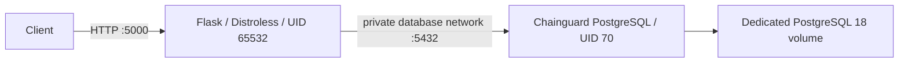

# Flask / PostgreSQL hardening report

Master 2 graded practical assignment, Benoît Bremaud and Clément Machtelinckx.
This report follows sections A-G and the seven reporting sections of the assignment.
Snapshot: **2026-10-08**, main commit
`83659230ccc2d74b514aaabf62f381cd468dcdb4` (merged [PR #30](https://github.com/clement-machtelinckx/linter-python-flask/pull/30)).
The final image scan and integration evidence below belong to this same main commit.
Release `v1.0.0` publishes the validated image for this commit; the registry and smoke-test proofs are recorded below.

## 1. Public GHCR packages and execution

**Publication and anonymous download verified on 2026-10-08.**
Public package: [linter-python-flask on GHCR](https://github.com/clement-machtelinckx/linter-python-flask/pkgs/container/linter-python-flask),
whose unauthenticated page displays **Public** and tag **v1.0.0**.
Successful [Release to GHCR run 37795286678](https://github.com/clement-machtelinckx/linter-python-flask/actions/runs/37795286678)
published source commit `83659230ccc2d74b514aaabf62f381cd468dcdb4` without rebuilding.

```bash
docker pull ghcr.io/clement-machtelinckx/linter-python-flask:v1.0.0
# Immutable reference:
docker pull ghcr.io/clement-machtelinckx/linter-python-flask@sha256:63b1a427ca8a14ae0d81031085ab3bbd9aa7129c08b733653c384185cd33cb3c
```

Verified registry manifest digest:
`sha256:63b1a427ca8a14ae0d81031085ab3bbd9aa7129c08b733653c384185cd33cb3c`.
The publication output, anonymous pull and SHA256 of the manifest bytes agree.
Its config digest is `sha256:1df3dc6cd2e69ae022e7bc92d5f964bd9b270cf2717a55daef772483a4d4f30d`,
exactly the image ID recorded in CI artifact **11556151455**. This image ID is
separate from the registry manifest digest. The release verifies the archive checksum,
commit, tag and image ID before loading and retagging that existing image.
The anonymous pull used `docker --config /tmp/ghcr-final-evidence/docker-anonymous pull ghcr.io/clement-machtelinckx/linter-python-flask:v1.0.0`
with an isolated `config.json` containing only `{}`.

The published image was then started by digest with the unchanged Chainguard
PostgreSQL digest and healthchecks from `docker-compose.yml`, using a temporary
Compose override (`pull_policy: never`) and `up --no-build --wait --wait-timeout 90`.
Both services became healthy; `/health` returned `{"status":"ok"}` and `/dbtest`
returned `{"db_connection":"successful"}`. The existing Pytest integration test
passed (one passed, five deselected); all temporary containers, networks and the DB
volume were removed and their absence checked. Only the separate test runner was
built; the API image was never rebuilt.

The local composition builds this repository's API instead of using that inherited image:

```bash
cp .env.example .env
# Set a fresh DB_PASSWORD in .env before proceeding; do not commit .env.
docker compose config --quiet
docker compose up --build --wait --wait-timeout 90
curl -fsS http://localhost:5000/health
curl -fsS http://localhost:5000/dbtest
```

Expected JSON: `{"status":"ok"}` and `{"db_connection":"successful"}`.
The API publishes port 5000; PostgreSQL publishes no host port. Choose another API
host port with a Compose override if 5000 is already occupied.
`docker compose down` stops this local composition without deleting database data.
CI uses temporary databases and additionally removes its own volumes during teardown.

## 2. Before / after measurements

Measurements use Linux amd64 and scans performed on 2026-10-08 with Trivy 0.75.0
and Dive 0.13.1. MB means decimal megabytes; image size is Docker's `.Size`,
not registry download size. Findings count package/CVE occurrences; distinct CVE IDs
are shown separately to avoid confusing the two metrics.

| API metric | Before: retained baseline | After: retained validated main image |
| --- | --- | --- |
| Docker image size | 148.28 MB (148,283,873 bytes) | 73.82 MB (73,817,990 bytes) |
| Execution user | UID 0 | UID/GID 65532:65532 |
| Shell | `/bin/sh` present | Checked shell paths absent |
| Build/package tools | General-purpose Python slim runtime | Checked compiler/package-manager paths absent; no pip or pytest module |
| Trivy findings, all severities | 185 occurrences / 92 distinct CVEs | 159 occurrences / 67 distinct CVEs |
| HIGH findings | 47 occurrences | 30 occurrences, no fixed version reported |
| CRITICAL findings | 0 | 0 |
| Fixable HIGH/CRITICAL | 3 | 0 |
| Python package findings | 20 occurrences, including bundled tooling | 0 |
| Dive efficiency | 97.3558% | 99.7821% |

Baseline image ID: `sha256:4738d877b71159d1fc40432b831513afbe74643f9543884fad2f292b54028c6e`.
Its `app.py` SHA256 is `cf6f28551581cc25a3f96e432b58148bcaf248f016e8e80e463b1aa2788de733`,
identical to the source at `b9c1bf2`. Its manifest contains Flask 2.3.2, Werkzeug
2.3.3, pytest 7.4.0 and unpinned psycopg2-binary. This is a **retrospective scan
of a retained baseline**, not a reconstructed claim about every historical deployment.
The original `python:3.10-slim` tag and unpinned dependency prevent exact historical reproduction.

Measured final image ID: `sha256:80dc0218bfcf8ec7acddf501b336654db5d7b9250915451ae8fc2975a78cfbbd`.
The size and runtime inspection above refer to the retained image from
[main run 37785679351](https://github.com/clement-machtelinckx/linter-python-flask/actions/runs/37785679351),
commit `3c74e98c7b5b6504cfb4217c9b8296358bb0ffec`; its archive checksum,
source commit and runtime were checked locally. The measured size reduction is 50.22%.
The Dockerfile and runtime manifest have not changed since that inspection.
The latest [main security/integration run 37789598329](https://github.com/clement-machtelinckx/linter-python-flask/actions/runs/37789598329)
confirms the same Dive score and vulnerability counts on commit `8365923`;
its image ID is `sha256:1df3dc6cd2e69ae022e7bc92d5f964bd9b270cf2717a55daef772483a4d4f30d`.
The full final report includes 74 MEDIUM, 53 LOW and two UNKNOWN findings alongside
30 HIGH findings. A passing security threshold **does not mean zero system CVEs**.

## 3. Architecture and base-image choices



[Dockerfile](Dockerfile) separates dependency installation from runtime:
`python:3.13.16-slim-trixie` installs the eight pinned packages in
[requirements-runtime.txt](requirements-runtime.txt) under `/opt/python`.
Only those packages and `app.py` are copied into `gcr.io/distroless/python3-debian13:nonroot`.
The full builder and runtime SHA256 references are recorded in the Dockerfile;
PostgreSQL's digest is recorded in [docker-compose.yml](docker-compose.yml).

The builder and runtime share CPython 3.13 ABI, Debian 13 and amd64.
The tested final runtime reports Python 3.13.5; it is not claimed to have the builder's
3.13.16 patch version. Binary psycopg2 wheels avoid leaving native build tools in the
runtime. Compatibility is demonstrated by imports, real PostgreSQL queries and tests.
The base image supplies `/usr/bin/python3.13` as its entrypoint, so the JSON `CMD`
contains `/app/app.py`.

Digest pinning fixes the base-image inputs. Runtime dependency versions are pinned;
quality CI additionally uses a hashed manifest. The runtime wheel installation is not
hash-locked, so byte-for-byte reproducibility is not claimed. Updating a base digest,
Python minor version or architecture requires repeating the build and integration checks.

[.dockerignore](.dockerignore) excludes environment files, credentials, Git metadata,
tests, caches, local virtual environments, reports, infrastructure, logs and archives.
Explicit `COPY` instructions keep these files out of the runtime.

The PostgreSQL image is Chainguard, pinned by digest, running as UID/GID 70:70 with
all capabilities dropped and `no-new-privileges`. It only joins an internal database
network. Both services receive credentials through required environment variables;
an empty password is rejected by Compose. `.env.example` has no real password.

The new `db-data-pg18` volume is mounted at `/var/lib/postgresql`, with PGDATA
`/var/lib/postgresql/18/data`. It preserves the old PostgreSQL 14 volume by using a
different name; **it does not migrate its data**. A production migration is outside
this practical assignment's verified execution.

## 4. Healthchecks without a shell

The API probe uses exec-list `CMD`, `/usr/bin/python3.13` and `urllib.request` from the
standard library to request `/health`, require HTTP 200 and close the response.
The HTTP timeout is two seconds; the container probe timeout is three seconds,
with a ten-second interval, three retries and a ten-second startup period.
No shell, curl or additional Python package is required inside the API.

The database probe uses exec-list `CMD` and the image's `pg_isready`, targeting
127.0.0.1 with the configured database/user. Its interval is ten seconds, timeout
five seconds, five retries and startup period thirty seconds.
`depends_on: condition: service_healthy` prevents the API from starting before the
DB probe succeeds. Probe readiness alone is insufficient: `/dbtest` and pytest also
execute a real `SELECT 1` using psycopg2.

CI startup uses `docker compose up --no-build --wait --wait-timeout 90` against
the already validated API image. Both services must become healthy. A bounded
HTTP retry loop and fatal `curl -fsS` checks follow. Pytest runs in a separate Python
container on the private DB network, preserving the minimal API runtime.
Teardown uses `if: always()` and `down --volumes --remove-orphans`.

## 5. Dependency and quality remediation

| Component | Initial manifest | Current manifest | Reason |
| --- | --- | --- | --- |
| Flask | 2.3.2 | 3.1.3 | Remove scanner-reported affected versions |
| Werkzeug | 2.3.3 | 3.1.9 | Remove scanner-reported affected versions |
| pytest | 7.4.0 | 9.1.1 | Update test tooling; excluded from API runtime |
| psycopg2-binary | Unpinned | 2.9.13 | Pin and verify the retained psycopg2 API |
| Runtime transitives | Implicit | Eight runtime packages explicitly pinned | Make dependency inputs inspectable |

The retrospective baseline scan identifies Flask CVE-2026-27205, pytest
CVE-2025-71176, and these Werkzeug CVEs: CVE-2023-46136, CVE-2024-34069,
CVE-2024-49766, CVE-2024-49767, CVE-2025-66221, CVE-2026-102598,
CVE-2026-21860 and CVE-2026-27199. Other baseline Python findings concern bundled
tooling; they are included in the baseline total and are not attributed to Flask.
The final image scan detects no Python package vulnerabilities. This is a
scanner result at the recorded date, not a guarantee against future advisories.

The initial Flake8 audit already passed with the supplied configuration. No invented
lint violation or weakened rule is reported: [.flake8](.flake8) remains unchanged.
[PR #21](https://github.com/clement-machtelinckx/linter-python-flask/pull/21)
strengthened exact JSON assertions, added useful success/failure database tests,
registered the integration marker and removed internal DB errors from HTTP responses.
There are five database-independent test cases and one real-DB integration test.

[.hadolint.yaml](.hadolint.yaml) sets failure threshold `warning`, restricts registries
to docker.io, gcr.io, cgr.dev and ghcr.io, and raises DL3002, DL3007 and DL4006 to
`error`. The current Dockerfile passes this configuration, uses JSON startup,
explicit multi-stage copies and no-cache installation.

A fresh pip-audit 2.10.1 scan of `requirements.txt` found zero known vulnerabilities
in the 20 applicable packages, with no skipped package. The command used `--no-deps`
and `--disable-pip` because the manifest already pins the declared dependency set;
this advisory lookup does not replace installation or runtime compatibility tests.

The older [dependency report](security-dependencies.md) describes evidence files and
hash-locked manifests absent from this snapshot. Those missing links are not accepted
as proof here. Current claims rely on the manifests and newly collected scanner results.

## 6. CI/CD security and verified release

[quality.yml](.github/workflows/quality.yml) runs Flake8, unit tests and configured
Hadolint on pushes and pull requests targeting main, with `contents: read` and
external actions pinned to full commit SHAs.
[image-security.yml](.github/workflows/image-security.yml) builds using BuildKit,
requires Dive efficiency at least 80%, saves a full Trivy report including unfixed
findings, and enforces `--severity HIGH,CRITICAL --ignore-unfixed --exit-code 1`.
This matches the assignment's detailed rule for **fixable** HIGH/CRITICAL findings.

After security passes, it exports the image archive, checksum, source SHA, tag and
image ID. The reusable [integration workflow](.github/workflows/multi-container.yml)
is chained with `needs: image-security`, verifies those values, loads the image,
and prevents API rebuild/pull. Its PostgreSQL digest remains pullable on a fresh runner.

[PR #30](https://github.com/clement-machtelinckx/linter-python-flask/pull/30) resolved
both previously reported CI gaps: image-security now requires the reusable quality
job before building, and all external actions, including legacy deployment workflows,
use full commit SHAs. Deployment workflows remain manual-only.

[PR #28](https://github.com/clement-machtelinckx/linter-python-flask/pull/28) replaced
the inherited publisher. A `vX.Y.Z` or valid prerelease tag must point to current main.
The validation job requires successful quality and security/integration jobs for
that exact SHA and retrieves the associated non-expired validated image artifact.
The publication job uses the native token, has `packages: write` only at job scope,
checks the archive/commit/tag/image ID, and publishes without rebuilding.
Existing SemVer tags are refused, releases are serialized, and SHA tags provide
traceability. Build metadata is rejected because Docker tags do not accept `+`.
All actions in this release workflow use full commit SHAs.

The successful current-main checks are [quality run 37789597550](https://github.com/clement-machtelinckx/linter-python-flask/actions/runs/37789597550)
and [security/integration run 37789598329](https://github.com/clement-machtelinckx/linter-python-flask/actions/runs/37789598329).
The [successful release run](https://github.com/clement-machtelinckx/linter-python-flask/actions/runs/37795286678)
validated those exact source runs, downloaded artifact 11556151455 and published
`v1.0.0` and `sha-83659230ccc2`. Section 1 records public access, anonymous pull and
the matching registry/config digests. No quality or security gate was bypassed.

## 7. Execution evidence and compliance matrix

The [quality main run](https://github.com/clement-machtelinckx/linter-python-flask/actions/runs/37789597550)
and [security/integration main run](https://github.com/clement-machtelinckx/linter-python-flask/actions/runs/37789598329)
completed successfully for source commit `83659230ccc2d74b514aaabf62f381cd468dcdb4`.
Named security artifact: `image-security-83659230ccc2d74b514aaabf62f381cd468dcdb4`;
validated image artifact: `validated-image-83659230ccc2d74b514aaabf62f381cd468dcdb4`.
Artifacts have seven-day retention; download them before expiry for the final submission.

| Actual check | Result / exit status | Evidence |
| --- | --- | --- |
| `flake8 --config=.flake8 .` | No violations / 0 | Quality job `python-quality` |
| `pytest -m "not integration"` | Five cases pass / 0 | Quality job `python-quality` |
| Hadolint with `.hadolint.yaml` | No violations / 0 | Quality job `hadolint` |
| BuildKit build/check | Successful / 0 | Security job `Build final image` |
| Dive with `.dive-ci` | 99.7821%, threshold 80% / 0 | Artifact `dive.txt` |
| Full Trivy scan | 159 occurrences; Python 0 / 0 | Artifact `trivy-full.json` |
| `pip-audit -r requirements.txt --no-deps --disable-pip --format json` | 20 applicable packages, zero known vulnerabilities, no skips / 0 | Local `dependencies-final.json`, pip-audit 2.10.1 |
| Trivy fixable HIGH/CRITICAL gate | No matching findings / 0 | Artifact `trivy-gate.txt` |
| Archive verification | `image.tar: OK`; commit/tag/ID match / 0 | Integration job `Verify and load validated image` |
| Compose startup and HTTP checks | Both healthy; `/health` and `/dbtest` succeed / 0 | Integration job log |
| `pytest -v -m integration` | One passed, five deselected / 0 | Integration job log |
| Teardown | Both containers, both networks and DB volume removed / 0 | Integration job log |
| GHCR publication / SemVer pull | Published `v1.0.0`; anonymous pull / 0 | [Release run 37795286678](https://github.com/clement-machtelinckx/linter-python-flask/actions/runs/37795286678), public package and manifest in section 1 |
| Published-image smoke test | Both healthy; endpoints correct; one integration test passes / 0 | Local smoke output below, same manifest digest as section 1 |
| Published-image cleanup | Temporary containers, networks and DB volume absent / 0 | Explicit absence checks after `down --volumes --remove-orphans` |
| SonarQube / SonarCloud | GitHub check neutral; API quality gate `NONE` | [Main analysis](https://sonarcloud.io/dashboard?id=clement-machtelinckx_linter-python-flask&branch=main); no configured passing quality gate claimed |

Representative actual output:

```text
efficiency: 99.7821 %
PASS: lowestEfficiency
image.tar: OK
{"db_connection":"successful"}
1 passed, 5 deselected in 0.13s
```

Published-image smoke output (2026-10-08, Linux amd64):

```text
api-python: healthy
db: healthy
{"status":"ok"}
{"db_connection":"successful"}
Runtime: UID 65532 Python 3.13.5 checked shell/build-tool paths absent
1 passed, 5 deselected in 0.43s
CLEANUP: containers, networks and temporary volume absent
```

The current validated image's scan metadata records 76,446,208 uncompressed bytes;
the historical 73,817,990-byte measurement above is retained with its original SHA.
Current reports confirm Dive 99.7821%, 159 Trivy findings, zero CRITICAL and zero
fixable HIGH/CRITICAL. The published runtime inspection confirms UID 65532, Python
3.13.5, absent checked shell/compiler/package-manager paths, and no pip/pytest modules.
No Docker, Dive or Trivy scan was repeated for the already validated release commit.

Local supplementary evidence was collected under `/tmp/task013-evidence`: baseline
Trivy JSON, baseline Dive log, downloaded main artifacts, image archive and runtime
checks. Earlier positive/negative checks under `/tmp/task008-evidence` and
`/tmp/task011-evidence` cover all six tests, wrong credentials, empty test selection,
unhealthy DB blocking API startup, corrupted artifact metadata and cleanup.
These historical temporary paths are working evidence, not persistent repository links.
The release artifacts, manifest, publication log and targeted smoke output for this
session were collected under `/tmp/ghcr-final-evidence`; durable CI links are above.

### Evidenced requirement coverage

IDs follow the issue backlog's REQ-001 through REQ-019 mapping. Requirements are
counted equally; the percentage measures evidenced coverage, not a grade or a risk score.
An unresolved requirement is not counted as PASS, even when its issue is closed.

| ID | Requirement / assignment section | Status | Proof or remaining gap |
| --- | --- | --- | --- |
| REQ-001 | Supplied Flake8 configuration / A | PASS | Unchanged `.flake8`, quality main run |
| REQ-002 | Dependency remediation / E | PASS | Pinned manifest, final dependency audit and image scan |
| REQ-003 | Multi-stage build and dependency cache / C | PASS | Dockerfile, successful BuildKit job |
| REQ-004 | Distroless runtime without shell/build tooling / C | PASS | Pinned base, checked validated image runtime |
| REQ-005 | Dedicated non-root API user / C | PASS | Validated image UID 65532 |
| REQ-006 | Filtered build context / D | PASS | `.dockerignore`, explicit Dockerfile copies |
| REQ-007 | Strict Hadolint governance / B | PASS | Configuration and successful Hadolint job |
| REQ-008 | Dive efficiency at least 80% / D | PASS | 99.7821%, `dive.txt` |
| REQ-009 | Fatal fixable HIGH/CRITICAL gate / E | PASS | Zero matching findings; full unfixed report retained |
| REQ-010 | Chainguard PostgreSQL pinned by digest / F | PASS | Compose digest and healthy integration DB |
| REQ-011 | Native exec API probe / F | PASS | Python stdlib probe and healthy API |
| REQ-012 | Hardened DB isolation and configuration / F | PASS | UID 70, private network, no host DB port, required credentials |
| REQ-013 | Exec DB probe and healthy dependency / F | PASS | `pg_isready`, `service_healthy`, negative startup test |
| REQ-014 | Real endpoints and pytest integration / F | PASS | Main integration job, real `SELECT 1` |
| REQ-015 | Bounded startup and teardown / pipeline 5 | PASS | Wait timeout 90, successful unconditional cleanup |
| REQ-016 | Blocking quality before build / A, pipeline 1-4 | PASS | PR #30; image-security requires the successful reusable quality job |
| REQ-017 | All external actions immutable, least permissions / G | PASS | PR #30; full SHA references and default contents: read |
| REQ-018 | Gated SemVer GHCR distribution / G, pipeline 6 | PASS | Successful release run 37795286678; public v1.0.0, anonymous pull and matching validated image ID |
| REQ-019 | Complete seven-section report with public release proof / report | PASS | Seven sections, retained measurements, exact pull/digests, CI links and published-image smoke evidence |

**Evidenced technical coverage: 19 / 19 = 100%** for the listed requirements.
This counts demonstrated technical requirements; it does not assert a Sonar quality
gate PASS or invent either contributor's formal signature. The earlier
[final audit #14](https://github.com/clement-machtelinckx/linter-python-flask/issues/14)
covered the 17 technical requirements before release; the actual GHCR and reporting
proofs now complete the two remaining entries.

### Pair contributions

Clément's merged contributions: initial audit (#17), dependencies (#19), API image
(#20), build hygiene/Hadolint (#22), layer/security gates (#23), quality CI (#25), gated release workflow (#28).
Benoît's merged contributions: PostgreSQL hardening (#18), Flask quality/tests (#21),
exec healthcheck (#24), actual-image Compose integration (#26), validated artifact
integration (#27). This report is prepared by Benoît for Clément's review.
Clément completed CI corrections (#30), the authorized `v1.0.0` publication and
anonymous published-image verification, and updated these final README proofs for
[issue #31](https://github.com/clement-machtelinckx/linter-python-flask/issues/31).

[FINAL-CHECK.md](FINAL-CHECK.md) records the final requirement checks and merge conditions.
[Sonar PR #33](https://sonarcloud.io/dashboard?id=clement-machtelinckx_linter-python-flask&pullRequest=33)
passed its Quality Gate with Security Rating A; the historical neutral main check
is kept separate. Final merge still requires the latest CI results and Benoît's review.
